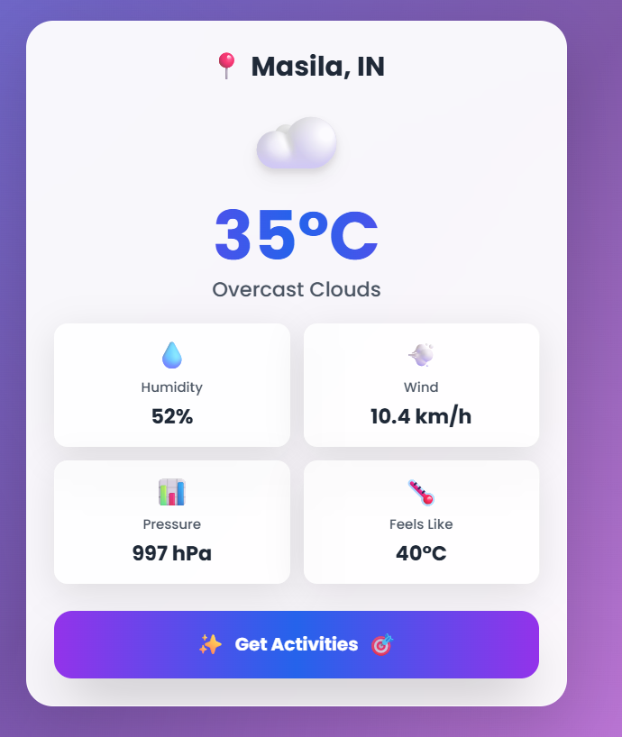

# AI Weather Hub ☀️⚡️

A sleek, weather web-app powered by OpenWeather API and Gemini AI. Instantly get precise weather updates, ask the built-in chatbot anything, and receive creative, weather-appropriate activity suggestions—all in an elegant, responsive UI.

## 🚀 Features

- **Real-Time Local Weather:** Detects your location and displays current temperature, description, humidity, wind, pressure, and feels like.
- **Gemini AI Chatbot:** Interactive, friendly assistant for all weather-related questions and advice.
- **Smart Activity Suggestions:** Inspiring activities tailored to your current weather.
- **Mobile-First Design:** Highly responsive layout with glassmorphism and vivid gradient visuals.
- **UX Enhancements:** Background click-to-close for chat; no scroll needed for main content; animated feedback throughout.
- **API Integration:** Easily connect your own API keys for OpenWeather and Gemini.

## 🖼️ Preview



## 📦 Installation & Usage

1. **Clone the Repository**
    ```
    git clone https://github.com/DiptarajSinha/ai-weatherhub.git
    cd ai-weatherhub
    ```

2. **Add Your API Keys**
    - Open `index.html` and insert your:
        - OpenWeather API key (`OPENWEATHER_API_KEY`)
        - Gemini API key (`GEMINI_API_KEY`)

3. **Run Locally**
    - Open `index.html` directly in your browser.

## 🛠️ Technologies Used

- **HTML5**, **CSS3** (with Tailwind CSS)
- **JavaScript (ES6+)**
- **APIs:** [OpenWeather](https://openweathermap.org/api), [Gemini AI](https://ai.google.dev/gemini-api/)
- **Responsive/Glass UI Design**

## 🤖 AI & API Integration

- **Gemini AI:** Chatbot and creative activity suggestions
- **OpenWeather API:** Real-time, location-based weather

## 📱 Mobile Experience

- 100% mobile-first: Buttons, chat, cards, and modals adapt beautifully to any screen.
- Close chatbot by tapping the blurred overlay for intuitive UX.

## 📝 Customization

- Easily modify colors and fonts in the `<style>` block (uses Poppins).
- Change activity prompt wording for alternative AI suggestions or localize strings.

## 💡 Inspiration

Designed for people who want hyper-local weather insights with a bit of magic and fun. Built for students, weather enthusiasts, and anyone needing quick, modern weather access.


**Made with ❤️ using AI & coffee. If you like it, star the repo!**

